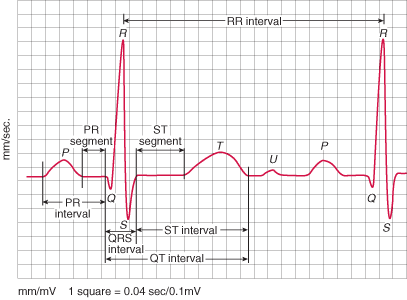
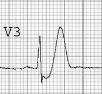

{:: encoding="utf-8" /}

# Investigations

## ECG

### Miscellaneous notes

- to eyeball the QT interval, without formally calculating the corrected time, should be less than half the RR interval
- QT interval is measured from the _start_ of the Q wave to the _end_ of the T wave
- U waves occur after the T-wave, should be in the same direction as the T-wave, and are mostly easily seen at slow heart rates 
- Look carefully for ST elevation > 1mm in aVR as a sign of LAD/Left Main stem occlusion (ST elevation equivalent);Absence of ST elevation in aVR almost entirely excludes a significant LMCA lesion but ST elevation in aVR > 1mm should make you think of LAD or Left Main Stem disease
    + Consider de Winter's T-waves as an STEMI equivalent; present in 2% of LAD disease

- electrical alternans: wandering baseline and alternating QRS complexes or axis between beats associated with pericardial effusion as heart moves in fluid filled sac; Remember to check for associated pulsus paradoxus (fall in blood pressure >10mmHg with inspiration)

## References and credits

- [Normal ECG complex](http://lifeinthefastlane.com/ecg-library/basics/u-wave/)
- de Winter's T-waves  via [Life in the Fastlane](http://lifeinthefastlane.com/winter-is-coming/)

